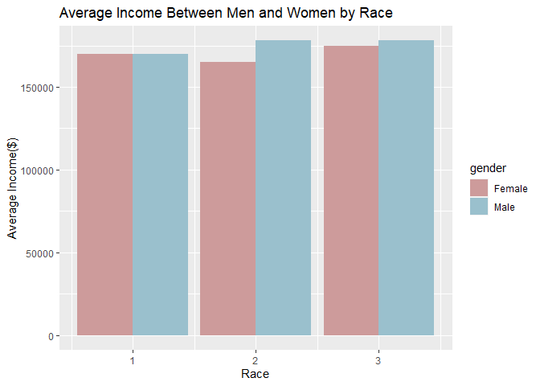
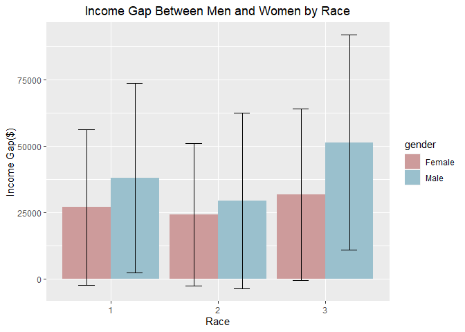
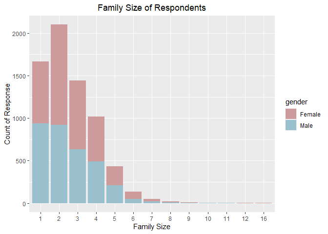
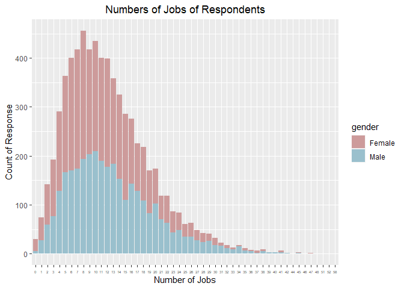
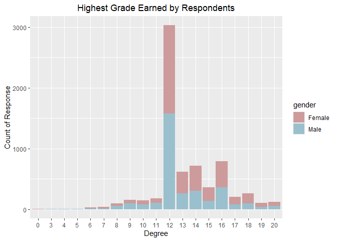
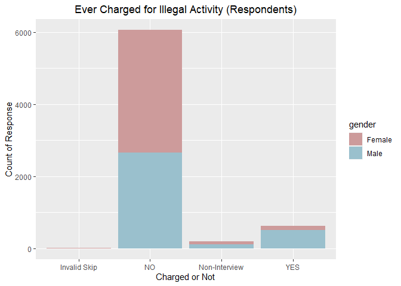
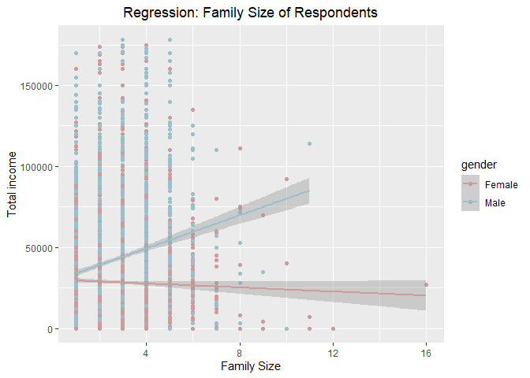
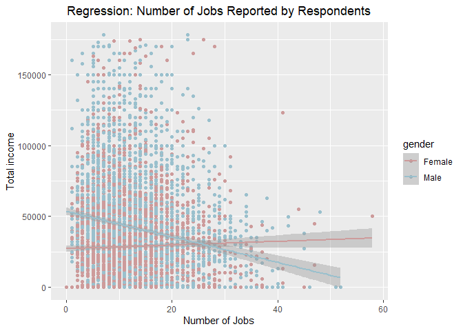

```
## Warning: package 'tidyverse' was built under R version 4.0.2
```

```
## -- Attaching packages -------------------------------------------------------------------------------- tidyverse 1.3.0 --
```

```
## v tibble  3.0.1     v dplyr   1.0.0
## v tidyr   1.1.0     v stringr 1.4.0
## v readr   1.3.1     v forcats 0.5.0
## v purrr   0.3.4
```

```
## -- Conflicts ----------------------------------------------------------------------------------- tidyverse_conflicts() --
## x readr::col_factor() masks scales::col_factor()
## x purrr::discard()    masks scales::discard()
## x dplyr::filter()     masks stats::filter()
## x dplyr::lag()        masks stats::lag()
```


##1. Data Summary

In order to better understand our data, we use a demographic characteristic (Race) to provide more details on our respondents.


```r
table(NLSY79$race, NLSY79$gender)
```

```
##    
##     Female Male
##   1   1002 1000
##   2   1561 1613
##   3   3720 3790
```
From the table, we can observe that the distribution between race is not well-distributed among the three categories. Non-black and non-Hispanic are the majority of respondents for both gender.

Since we are researching on the topic of whether income difference is due to gender, we should also note that the total income is top-coded. Hence, for those top 2% of earners, only an average income value ($343,830) was displayed. Because of the extreme data, we then remove the top 143 values.


```r
summary(NLSY79$income)
```

```
##    Min. 1st Qu.  Median    Mean 3rd Qu.    Max. 
##      -5      -5       0   22773   34000  343830
```

```r
qplot(NLSY79$income)
```

```
## `stat_bin()` using `bins = 30`. Pick better value with `binwidth`.
```

<!-- -->

```r
Top_income_rows <- NLSY79 %>% filter(income == max(income, na.rm = TRUE))
nrow(Top_income_rows)
```

```
## [1] 143
```


```r
NLSY79.exl.TI <- NLSY79 %>% filter(NLSY79$income != 343830 & income>= 0)
```

When using race as a factor to look at the income difference, there aren't any significant differences among males and females in the 3 race categories. However, we can still notice the small differences, where males earn slightly more than females for Black and Non-Black/ non-Hispanic respondents.


```r
ggplot(NLSY79.exl.TI, aes(x= race, y= income,fill= gender)) + geom_bar(position = "dodge", stat = 'identity') + scale_fill_manual(values= c("rosybrown3", "lightblue3"))+ labs (title = 'Average Income Between Men and Women by Race', x= 'Race', y= 'Average Income($)')
```

<!-- -->


```
## Loading required package: plyr
```

```
## ------------------------------------------------------------------------------
```

```
## You have loaded plyr after dplyr - this is likely to cause problems.
## If you need functions from both plyr and dplyr, please load plyr first, then dplyr:
## library(plyr); library(dplyr)
```

```
## ------------------------------------------------------------------------------
```

```
## 
## Attaching package: 'plyr'
```

```
## The following objects are masked from 'package:dplyr':
## 
##     arrange, count, desc, failwith, id, mutate, rename, summarise,
##     summarize
```

```
## The following object is masked from 'package:purrr':
## 
##     compact
```

```
##   gender race   income       sd
## 1 Female    1 26931.63 29264.79
## 2 Female    2 24095.83 26867.28
## 3 Female    3 31836.07 32397.88
## 4   Male    1 38056.58 35859.35
## 5   Male    2 29498.46 33164.64
## 6   Male    3 51394.87 40559.21
```

The table below showed the income differences between males and females by race. Rather than looking at the average income as above. This table gives us a bit more information on the distribution of income. However, since there are quite a few respondents who reported to earn $0 in the calendar year, we will only use the result as an indication for the following steps. With the 95% confidence bars, this helps us to determine the statistical difference in income between gender across race. For each race, males all earned higher income compared to females. The mean for male respondents is also higher than female respondents in various race categories. 


```r
ggplot(df1, aes(x= race, y= income,fill= gender)) + geom_bar(position = "dodge", stat = 'identity') + scale_fill_manual(values= c("rosybrown3", "lightblue3"))+ labs (title = 'Income Gap Between Men and Women by Race', x= 'Race', y= 'Income Gap($)') + geom_errorbar(aes(ymin= income - sd, ymax= income + sd), width = .3, position = position_dodge(.9)) + theme(plot.title = element_text(hjust = 0.5))
```

<!-- -->

Other than using race as our factor consideration, I have also picked four other variables to test whether they played a role in causing the difference in income among males and females. A table is following by each variable to show the variable's distributions analyzed across males and females.

**1. Family Size (T41122.00)**

This variable is a numeric answer that respondents gave as to their family size in 2012. The answer range from the size of 1 to 10+. This variable is chosen with the assumption of larger family size might require on to work longer hours or shifts, which in results of higher income.


```r
ggplot(famsize.gender, aes(x= factor(FAMSIZE_2012), fill = gender))+ geom_bar(stat = 'count') + scale_fill_manual(values= c("rosybrown3", "lightblue3"))+ labs (title = 'Family Size of Respondents', x= 'Family Size', y= 'Count of Response') + theme(plot.title = element_text(hjust = 0.5))
```

<!-- -->

**2. Numbers of Different Jobs Reported as of Interview Date (T41149.00)**

This variable is a numeric answer, which ranges from 0 to 50+. This variable is chosen because with higher numbers of jobs indicated, this might imply one is constantly changing jobs due to some reason (ex. poor performance at a job, not willing to do certain works, etc.). The cause could be due to various reasons, which can also have impact on income.

```r
ggplot(NLSY79.exl.TI, aes(x= factor(JOBSNUM_2012), fill = gender))+ geom_bar(stat = 'count') + scale_fill_manual(values= c("rosybrown3", "lightblue3"))+ labs (title = 'Numbers of Jobs of Respondents', x= 'Number of Jobs', y= 'Count of Response') + theme(plot.title = element_text(hjust = 0.5))+ theme(axis.text.x=element_text(size=rel(0.5)))
```

<!-- -->

**3. Highest Grade Completed (T41130.00)**

This variable is a factor answer from the respondent, which 93 and 94 indicate Kindergarten, 1 thru 5 indicates elementary school, 6 to 8 indicates middle school, and 9 to 12 indicates high school, and 13 to 20 indicates College. The variable is chosen as it could often predict one's future income based on one's education level.


```r
ggplot(NLSY79.exl.TI, aes(x= factor(highestgrade), fill = gender))+ geom_bar(stat = 'count') + scale_fill_manual(values= c("rosybrown3", "lightblue3"))+ labs (title = 'Highest Grade Earned by Respondents', x= 'Degree', y= 'Count of Response') + theme(plot.title = element_text(hjust = 0.5))
```

<!-- -->

**4. Ever Charged With Police for Illegal Activity (R03071.00)**

This variable is a categorical answer, which consists of either YES or NO. The survey question is "NOT COUNTING MINOR TRAFFIC OFFENSES, HAVE YOU EVER BEEN BOOKED OR CHARGED FOR BREAKING A LAW, EITHER BY THE POLICE OR BY SOMEONE CONNECTED WITH THE COURTS?". Since minor traffic offenses are excluded from the question, with the factor of being charged with illegal activity, the record might affect one when looking for jobs or the level of salary that one is earning.


```r
ggplot(NLSY79.exl.TI, aes(x= factor(`POLICE-2_1980`), fill = gender))+ geom_bar(stat = 'count') + scale_fill_manual(values= c("rosybrown3", "lightblue3"))+ labs (title = 'Ever Charged for Illegal Activity (Respondents)', x= 'Charged or Not', y= 'Count of Response') + theme(plot.title = element_text(hjust = 0.5))
```

<!-- -->

##2. Methodology

There are quite a few missing values in the dataset, where some are actually missing values, some 0 are indicating a meaning. For variables that have missing values, I first went in to check whether the missing values would impact my result or not. Hence, I did not replace all missing values with NA at the beginning of the project as it could affect my data processing. For factor variables, 0 or negative numbers often have the meaning assigned to it. Hence, with all the factor variable I worked with, I replaced the coded number by its actual meaning. The data would then be processed as categorical answers rather than numeric data.

Since I transferred any 0 or negative numbers to their own meaning, I was able to interpret the data more easily. Especially when looking at the data in table or chart format, I found it easier not only for myself but for readers to read and understand what the takeaway messages are.

Since the topcoded format is especially significant for the income variable, I excluded those data from my analysis. As the topcoded 2% income is just an averaged number, there won't be much meaning if I calculated them in. By removing the topcoded data, the range of values for which any patterns and models we ran will be more valid and applicable for us to fo further analysis as well.

The plot that is comparing gender and income by race was surprisingly not significant. I thought there would be huge differences between male and female in each race, but the differences are only minimal. I also tried to compare the hours of spouse worked per week to gender, and the result wasn't as expected as well. The result only showed a very skewed data as the average working hours are around 40. Hence, I decided to take that variable out in the process of data exploring and not use it for further analysis. I also took out the variable of numbers of biological children when comparing it to gender. I later then realized that the variable was only surveyed to female respondents, which wouldn't be valid to be used in further analysis.
 
My approach would be running a linear regression on the chosen variables, this would better help me to understand the direction and statistical significance of each of the variables. After running a linear regression on the difference variable, we will then use all variables together to run a regression so that we can have a better picture of the data, in order to answer the main question of the project. I will be using the following 5 factors in my analysis, race, family size, number of jobs reported, highest grade completed, and whether one has been charged with illegal activity or not.

##3. Findings

**Linear Model 1:**

```r
race_regress <- lm(income ~ gender + race, data = NLSY79.exl.TI)
summary(race_regress)
```

```
## 
## Call:
## lm(formula = income ~ gender + race, data = NLSY79.exl.TI)
## 
## Residuals:
##    Min     1Q Median     3Q    Max 
## -46079 -26688  -6079  18305 149320 
## 
## Coefficients:
##             Estimate Std. Error t value Pr(>|t|)    
## (Intercept)  14672.9     1354.2   10.84   <2e-16 ***
## genderMale   13384.2      827.2   16.18   <2e-16 ***
## race          6007.4      533.8   11.25   <2e-16 ***
## ---
## Signif. codes:  0 '***' 0.001 '**' 0.01 '*' 0.05 '.' 0.1 ' ' 1
## 
## Residual standard error: 34270 on 6878 degrees of freedom
## Multiple R-squared:  0.05324,	Adjusted R-squared:  0.05296 
## F-statistic: 193.4 on 2 and 6878 DF,  p-value: < 2.2e-16
```
From the result of the linear model 1, gender appears to be statistically significant on the income variable. Our p-value (2.2e-16, very close to 0) also indicated that we can reject the null hypothesis and confirm that there is a relationship existed between gender and race. We can conclude that with our model, we can predict that the total income is very likely to be 13478.7 greater than the value when the respondent is female.

**Linear Model 2:**

```r
famsize_regress <- lm(income ~ gender + race + FAMSIZE_2012, data = NLSY79.exl.TI)
summary(famsize_regress)
```

```
## 
## Call:
## lm(formula = income ~ gender + race + FAMSIZE_2012, data = NLSY79.exl.TI)
## 
## Residuals:
##    Min     1Q Median     3Q    Max 
## -58258 -26541  -6291  18295 151098 
## 
## Coefficients:
##              Estimate Std. Error t value Pr(>|t|)    
## (Intercept)    8291.7     1590.6   5.213 1.91e-07 ***
## genderMale    13749.5      825.2  16.661  < 2e-16 ***
## race           6223.2      532.4  11.688  < 2e-16 ***
## FAMSIZE_2012   2193.3      289.8   7.568 4.30e-14 ***
## ---
## Signif. codes:  0 '***' 0.001 '**' 0.01 '*' 0.05 '.' 0.1 ' ' 1
## 
## Residual standard error: 34130 on 6877 degrees of freedom
## Multiple R-squared:  0.06106,	Adjusted R-squared:  0.06065 
## F-statistic: 149.1 on 3 and 6877 DF,  p-value: < 2.2e-16
```
In linear model 2, we added another variable, which is the family size of respondents. We can see that the result are still statistically significant, with a p-value very close to 0. From the positive estimated coefficient of 1,928, this indicates that as the family size increases, the income of our respondents would increase by this amount on average.


```r
ggplot(NLSY79.exl.TI,aes(x= FAMSIZE_2012, y= income, color= gender)) + geom_point() + labs(x= 'Family Size', y= 'Total income', title= "Regression: Family Size of Respondents") + geom_smooth(method= 'lm') + scale_color_manual(values= c("rosybrown3", "lightblue3")) + theme(plot.title = element_text(hjust = 0.5))
```

```
## `geom_smooth()` using formula 'y ~ x'
```

<!-- -->
This graph shows the plots of our chosen variable, which are Total income and respondents' family size. The regression line in the graph also gives us a better idea of the approximation of our linear model result. This graph also implies the same idea as our linear model 2 result, which is that as the respondent's family size increases, male respondents' income would rise as well. With the gray shading area around the regression line, we can see the shading indicating that the income between males and females is statistically significant (shades do not overlap with each other). 

**Linear Model 3:**

```r
jobsnum_regress <- lm(income ~ gender + race + FAMSIZE_2012 + JOBSNUM_2012, data = NLSY79.exl.TI)
summary(jobsnum_regress)
```

```
## 
## Call:
## lm(formula = income ~ gender + race + FAMSIZE_2012 + JOBSNUM_2012, 
##     data = NLSY79.exl.TI)
## 
## Residuals:
##    Min     1Q Median     3Q    Max 
## -61380 -26551  -5850  17956 153747 
## 
## Coefficients:
##              Estimate Std. Error t value Pr(>|t|)    
## (Intercept)  13166.61    1733.77   7.594 3.51e-14 ***
## genderMale   14299.42     826.24  17.307  < 2e-16 ***
## race          6355.03     530.96  11.969  < 2e-16 ***
## FAMSIZE_2012  2007.82     290.08   6.922 4.87e-12 ***
## JOBSNUM_2012  -404.66      58.29  -6.942 4.22e-12 ***
## ---
## Signif. codes:  0 '***' 0.001 '**' 0.01 '*' 0.05 '.' 0.1 ' ' 1
## 
## Residual standard error: 34010 on 6876 degrees of freedom
## Multiple R-squared:  0.06759,	Adjusted R-squared:  0.06705 
## F-statistic: 124.6 on 4 and 6876 DF,  p-value: < 2.2e-16
```

With additional variable Number of Jobs being adding into our model, the majority of existing variables only changed at a minimal level. All p-values are still statistically significant.


```r
ggplot(NLSY79.exl.TI,aes(x= JOBSNUM_2012, y= income, color= gender)) + geom_point() + labs(x= 'Number of Jobs', y= 'Total income', title= "Regression: Number of Jobs Reported by Respondents") + geom_smooth(method= 'lm') + scale_color_manual(values= c("rosybrown3", "lightblue3")) + theme(plot.title = element_text(hjust = 0.5))
```

```
## `geom_smooth()` using formula 'y ~ x'
```

<!-- -->
From this graph, we can clearly see that the regression line for male and female overlaps when the number of jobs is around 50. Females actually started to earn more when they had more experience in jobs. However, we can see that the regression line for females did not rise drastically considering how significant the regression line for male drops as the number of jobs increases. However, this could also be due to the fact that we have fewer data when the number of jobs increases.

**Linear Model 4:**

```r
highgrade_regress <- lm(income ~ gender + race + FAMSIZE_2012 + JOBSNUM_2012 + highestgrade, data = NLSY79.exl.TI)
summary(highgrade_regress)
```

```
## 
## Call:
## lm(formula = income ~ gender + race + FAMSIZE_2012 + JOBSNUM_2012 + 
##     highestgrade, data = NLSY79.exl.TI)
## 
## Residuals:
##    Min     1Q Median     3Q    Max 
## -85621 -21883  -3388  17081 159425 
## 
## Coefficients:
##               Estimate Std. Error t value Pr(>|t|)    
## (Intercept)  -52740.10    2356.21 -22.383  < 2e-16 ***
## genderMale    16981.89     755.64  22.474  < 2e-16 ***
## race           3050.67     491.32   6.209 5.64e-10 ***
## FAMSIZE_2012   1301.04     264.78   4.914 9.14e-07 ***
## JOBSNUM_2012   -587.48      53.29 -11.023  < 2e-16 ***
## highestgrade   5754.50     152.73  37.677  < 2e-16 ***
## ---
## Signif. codes:  0 '***' 0.001 '**' 0.01 '*' 0.05 '.' 0.1 ' ' 1
## 
## Residual standard error: 30970 on 6875 degrees of freedom
## Multiple R-squared:  0.2272,	Adjusted R-squared:  0.2266 
## F-statistic: 404.2 on 5 and 6875 DF,  p-value: < 2.2e-16
```
After adding the variable of Highest Grade of Respondents, we can see some drastic changes to our model. In every level of school, the p-values are all above .05, which indicates the insignificant statistics. We can then determine this variable does not have a linear relationship on respondents' income. This variable will be removed from our next model analysis.

**Linear Model 5:**

```r
police_regress <- lm(income ~ gender + race + FAMSIZE_2012 + JOBSNUM_2012 + policeQ2, data = NLSY79.exl.TI)
summary(police_regress)
```

```
## 
## Call:
## lm(formula = income ~ gender + race + FAMSIZE_2012 + JOBSNUM_2012 + 
##     policeQ2, data = NLSY79.exl.TI)
## 
## Residuals:
##    Min     1Q Median     3Q    Max 
## -61382 -26551  -5851  17953 153745 
## 
## Coefficients:
##              Estimate Std. Error t value Pr(>|t|)    
## (Intercept)  13174.84    1738.72   7.577 3.99e-14 ***
## genderMale   14297.87     826.66  17.296  < 2e-16 ***
## race          6354.19     531.17  11.963  < 2e-16 ***
## FAMSIZE_2012  2007.65     290.11   6.920 4.92e-12 ***
## JOBSNUM_2012  -404.95      58.47  -6.926 4.72e-12 ***
## policeQ2        28.95     455.04   0.064    0.949    
## ---
## Signif. codes:  0 '***' 0.001 '**' 0.01 '*' 0.05 '.' 0.1 ' ' 1
## 
## Residual standard error: 34020 on 6875 degrees of freedom
## Multiple R-squared:  0.06759,	Adjusted R-squared:  0.06692 
## F-statistic: 99.68 on 5 and 6875 DF,  p-value: < 2.2e-16
```
The result of linear model 5 has a similar result as to model 4. We can see whether respondents have been charged for illegal activity or not is not statistically significant to their income, all of the p-values for this variable are above .05 as well. Hence, we will go ahead and determine this variable does not have a linear relationship with our target variables.

##4. Discussion

Based on our findings from the 5 Linear Model we ran, we can say that respondents' race, family size and the number of jobs they had could all be considered as a factor when discussing the income difference between males and females.

- As respondents' family size increased, we can clearly see that male's income would rise significantly. On the other side, as family size increased, female's income actually showed the tendency of decreasing. This may be due to the social pressure back in an early society where females need to stay at home to take care of the family. While the male is supposed to be the one who takes care of the family financially, hence male's income would increase. 

- As the number of jobs reported increased, we can actually see that male's income dropped a lot along with the trend, and female's income started to rise as the number of jobs goes up. I was quite surprised by the result of this variable as I didn't think there would be such a huge difference between gender. However, since we do not know the reason for changing jobs, it is hard to determine what could cause this effect.

- As the level of grade completed, we actually don't see a relationship between this factor and income. This result also surprised me as often times education can determine your salary. However, since the data was collected from individuals who were born in the 1900s, the effect of education might differ compared to the standard nowadays.

- Whether respondents had been charged with illegal activity by police also didn't show a significant influence on income between gender. I was also surprised by this result, but I also think the response from respondents is questionable. Even though the survey stated illegal activity is excluding any minor traffic violation, respondents might have a different interpretation as to the meaning of the illegal activity.

However, there are certainly some limitations that existed in this analysis. We are only looking at 5 variables in our analysis, which there could be a third variable that is affecting the income gap that we are not aware of.

I am not a hundred percent confident in my analysis at this point, the reason is due to the lack of variables in the analysis. I would say I do agree that race, family size and number of jobs have a positive impact on the income between gender. I also agreed with my result, which I determined whether respondents had been charged for illegal activity and respondents' highest grades have a negative relationship with income by looking at the data I processed. But overall, I do feel quite confident as to the process I went through when looking at each variable.
